<div align="center">

# 🎯 InterviewIQ
### AI-Powered Interview Intelligence System

[](https://aws.amazon.com)
[](https://python.org)
[](https://react.dev)
[](https://anthropic.com)
[](https://tamu.edu)

**Turn cold outreach into warm, intelligent conversations — in under 5 minutes.**

[📐 Architecture](#️-architecture) • [🚀 Quick Start](#-quick-start) • [🔗 API Reference](#-api-reference) • [🔄 Workflow](#-how-it-works)

</div>

---

## 🌟 What is InterviewIQ?

InterviewIQ is a **full-stack, serverless AI system** built for Texas A&M researchers, faculty, and students who need to conduct high-quality business intelligence interviews — but only have minutes to prepare.

Instead of walking into an interview cold, **InterviewIQ does the research for you**:

| Without InterviewIQ | With InterviewIQ |
|---|---|
| Hours of manual company research | ✅ AI scrapes & analyzes company data automatically |
| Generic, surface-level questions | ✅ 8-10 customized, evidence-based questions generated by Claude AI |
| Awkward interview openers | ✅ Built-in "what did AI get wrong?" rapport-builder |
| One-sided preparation | ✅ Interviewee reviews AI findings & selects preferred questions |
| Missed insights | ✅ Structured conversation flow surfacing deep insights |

---

## 🏗️ Architecture

InterviewIQ is built **entirely serverless on AWS** — no servers to manage, scales automatically, near-zero idle cost.

```
┌─────────────────────────────────────────────────────────────────┐
│                     AWS AMPLIFY (Frontend)                      │
│             React + Vite  •  Dark Theme  •  4 Routes            │
│   ┌──────────┐  ┌─────────────┐  ┌──────────┐  ┌───────────┐   │
│   │ HomePage │  │  Interviewer│  │Interviewee│  │   Final   │   │
│   │  (input) │  │  Dashboard  │  │  Portal  │  │   Guide   │   │
└───┴────┬─────┴──┴──────┬──────┴──┴────┬─────┴──┴─────┬─────┴───┘
         │               │              │               │
         ▼               ▼              ▼               ▼
┌─────────────────────────────────────────────────────────────────┐
│                   API GATEWAY  (REST /dev)                      │
│   POST /pipeline   GET /sessions/{id}   POST /sessions/{id}/fb  │
│   POST /sessions   POST /scrape   POST /parse   POST /analyze   │
│   POST /generate   GET /health                                  │
└──────────────────────────────┬──────────────────────────────────┘
                               │
          ┌────────────────────┼────────────────────┐
          ▼                    ▼                    ▼
┌──────────────────┐  ┌─────────────────┐  ┌──────────────────┐
│  STEP FUNCTIONS  │  │  9 LAMBDA FNs   │  │  LAMBDA LAYER    │
│  interview-iq-   │  │  Python 3.13    │  │  shared-deps v2  │
│  pipeline        │  │                 │  │                  │
│                  │  │  create_session │  │  bedrock         │
│  ① CreateSession │  │  get_session    │  │  comprehend      │
│  ② Parallel:     │  │  scrape_company │  │  dynamo          │
│    ├─ Scrape     │  │  parse_document │  │  s3              │
│    └─ Parse      │  │  analyze_company│  │  scraper         │
│  ③ Analyze       │  │  generate_brief │  │  textract        │
│  ④ GenerateBrief │  │  submit_feedback│  │  response_helpers│
│  ⑤ Complete      │  │  start_pipeline │  │                  │
└──────────────────┘  └─────────────────┘  └──────────────────┘
          │                    │
          ▼                    ▼
┌──────────────────┐  ┌─────────────────┐  ┌──────────────────┐
│    DynamoDB      │  │       S3        │  │     Bedrock      │
│  Sessions Table  │  │  Documents      │  │  Claude 3.5      │
│  PK: sessionId   │  │  Briefs         │  │  Sonnet          │
│  SK: createdAt   │  │  Scraped Data   │  │  (us-east-1)     │
└──────────────────┘  └─────────────────┘  └──────────────────┘
```

---

## 🔄 How It Works

The system facilitates a two-stage interview intelligence process:

```mermaid
sequenceDiagram
    participant I as 👔 Interviewer
    participant App as 🤖 InterviewIQ
    participant AI as ✨ Claude (Bedrock)
    participant E as 🏢 Interviewee

    rect rgb(30, 50, 80)
        Note over I,E: Stage 1 — Pre-Interview Preparation
        I->>App: Enter company name + URL
        App->>App: 🔍 Scrape public web data
        App->>App: 📄 Parse uploaded .docx docs
        App->>AI: Analyze data → generate brief
        AI-->>App: 8-10 crafted questions + conversation flow
        App-->>I: ✅ Interviewer Dashboard ready
        I->>E: Share pre-interview packet link
        E->>App: Review "what AI knows" about their org
        E->>App: ✏️ Correct AI inaccuracies
        E->>App: ⭐ Select 2-3 preferred questions
    end

    rect rgb(30, 80, 50)
        Note over I,E: Stage 2 — The Interview
        I->>E: "What did AI misunderstand?" (warm opener)
        E->>I: Surfaces nuance, builds rapport
        I->>E: Works through interviewee-selected questions
        I->>E: Follows conversation flow + follow-up stems
        App-->>I: Final Guide with all corrections applied
    end
```



---

## 🧠 AI Intelligence Stack

| Capability | AWS Service | What It Does |
|---|---|---|
| **Brief Generation** | Amazon Bedrock (Claude 3.5 Sonnet) | Generates structured interview briefs with 8-10 expert questions |
| **Entity Extraction** | Amazon Comprehend | Identifies companies, people, locations, dates from scraped data |
| **Sentiment Analysis** | Amazon Comprehend | Flags tone and context clues in company documents |
| **Document Parsing** | Amazon Textract | Extracts text from PDFs and scanned documents |
| **Web Scraping** | Custom BeautifulSoup4 | Pulls real-time company data from public websites |
| **Workflow Orchestration** | AWS Step Functions | Manages parallel data pipelines with automatic retry logic |

---

## 🚀 Quick Start

### Prerequisites
```
Node.js 18+  •  Python 3.13+  •  AWS CLI v2  •  AWS SAM CLI  •  AWS credentials
```

### Run the Frontend Locally
```bash
git clone https://github.com/mitalisakle20/AI-Interview-Intelligence.git
cd AI-Interview-Intelligence/frontend
npm install
npm run dev
# → Opens at http://localhost:5173
```

### Deploy the Full Backend to AWS
```bash
# 1. Configure your AWS credentials
aws configure

# 2. Build and deploy all 9 Lambda functions + Step Functions + DynamoDB + S3
cd backend
sam build
sam deploy \
  --stack-name interview-iq \
  --region us-west-2 \
  --resolve-s3 \
  --capabilities CAPABILITY_IAM CAPABILITY_AUTO_EXPAND \
  --no-confirm-changeset
```

---

## 📁 Project Structure

```
AI-Interview-Intelligence/
├── 📂 backend/
│   ├── template.yaml                    # SAM Infrastructure-as-Code (entire AWS stack)
│   ├── 📂 functions/                    # 9 Lambda handlers — one per API endpoint
│   │   ├── health/handler.py            #  GET  /health
│   │   ├── create_session/handler.py    #  POST /sessions
│   │   ├── get_session/handler.py       #  GET  /sessions/{id}
│   │   ├── scrape_company/handler.py    #  POST /scrape
│   │   ├── parse_document/handler.py    #  POST /parse
│   │   ├── analyze_company/handler.py   #  POST /analyze
│   │   ├── generate_brief/handler.py    #  POST /generate
│   │   ├── submit_feedback/handler.py   #  POST /sessions/{id}/feedback
│   │   └── start_pipeline/handler.py    #  POST /pipeline
│   ├── 📂 shared/                       # Shared service modules (deployed via Lambda Layer)
│   │   ├── bedrock_service.py           # Claude AI integration
│   │   ├── comprehend_service.py        # NLP entity/sentiment analysis
│   │   ├── dynamo_service.py            # Session state management
│   │   ├── s3_service.py               # Document storage
│   │   ├── scraper_service.py           # Web scraping engine
│   │   ├── textract_service.py          # PDF/doc text extraction
│   │   └── response_helpers.py          # Standardized API responses
│   └── 📂 statemachine/
│       └── interview_pipeline.asl.json  # Step Functions state machine definition
├── 📂 frontend/
│   └── 📂 src/
│       ├── App.jsx                      # Router — 4 core pages
│       ├── index.css                    # Design system (dark theme + glassmorphism)
│       ├── 📂 pages/
│       │   ├── HomePage.jsx             # Company input form
│       │   ├── InterviewerDashboard.jsx # Full brief + questions view
│       │   ├── IntervieweePortal.jsx    # Review, correct, select questions
│       │   └── InterviewGuide.jsx       # Live interview guide with corrections
│       └── 📂 services/
│           └── api.js                   # API client
└── 📂 docs/
    ├── ARCHITECTURE.md                  # Deep-dive system design
    ├── API_REFERENCE.md                 # Full endpoint documentation
    ├── DEPLOYMENT.md                    # Step-by-step deploy guide
    └── INTERVIEW_WORKFLOW.md            # Interview methodology
```

---

## 🔗 API Reference

| Method | Endpoint | Description |
|---|---|---|
| `GET` | `/health` | System health — confirms all AWS services are reachable |
| `POST` | `/sessions` | Create a new interview session |
| `GET` | `/sessions/{sessionId}` | Retrieve session data, status, and generated brief |
| `POST` | `/scrape` | Scrape company information from a given URL |
| `POST` | `/parse` | Parse uploaded .docx / PDF documents via Textract |
| `POST` | `/analyze` | Run Comprehend NLP: entities, sentiment, key phrases |
| `POST` | `/generate` | Call Claude 3.5 Sonnet to generate full interview brief |
| `POST` | `/sessions/{id}/feedback` | Submit interviewee corrections and question selections |
| `POST` | `/pipeline` | Trigger end-to-end Step Functions pipeline |
| `GET` | `/pipeline/{executionId}` | Poll pipeline execution status |

### Session Lifecycle
```
CREATED → SCRAPING → SCRAPING_COMPLETE → ANALYZING → GENERATING → READY
                                                                    │
                                                        Interviewee reviews
                                                                    ▼
                                                          FEEDBACK_RECEIVED
                                                                    ▼
                                                                COMPLETE
```

---

## 🛠️ Tech Stack

<div align="center">

| Layer | Technology |
|---|---|
| **Frontend** | React 18, Vite, CSS3 (Dark Theme + Glassmorphism) |
| **Hosting** | AWS Amplify (CI/CD from Git) |
| **API** | AWS API Gateway (REST), 10 endpoints |
| **Compute** | AWS Lambda (Python 3.13, x86_64), 9 functions |
| **Orchestration** | AWS Step Functions (parallel data pipeline) |
| **AI / LLM** | Amazon Bedrock — Claude 3.5 Sonnet |
| **NLP** | Amazon Comprehend (entities, sentiment, key phrases) |
| **OCR** | Amazon Textract (PDF + scanned doc extraction) |
| **Database** | Amazon DynamoDB (session state) |
| **Storage** | Amazon S3 (documents, briefs, scraped data) |
| **IaC** | AWS SAM (CloudFormation) |

</div>

---

## 📋 AWS Resources Deployed

| Resource | Name | Region |
|---|---|---|
| API Gateway | InterviewIQ-API | us-west-2 |
| DynamoDB Table | interview-iq-sessions | us-west-2 |
| S3 Bucket | interview-iq-docs | us-west-2 |
| Step Functions | interview-iq-pipeline | us-west-2 |
| Lambda Layer | interview-iq-shared-deps:2 | us-west-2 |
| CloudFormation Stack | interview-iq | us-west-2 |
| Bedrock Model | Claude 3.5 Sonnet | us-east-1 |

---

## 📖 Documentation

| Doc | Description |
|---|---|
| [ARCHITECTURE.md](docs/ARCHITECTURE.md) | Full system design, data flow, security model |
| [API_REFERENCE.md](docs/API_REFERENCE.md) | All endpoints with request/response schemas |
| [DEPLOYMENT.md](docs/DEPLOYMENT.md) | Step-by-step AWS deployment guide |
| [INTERVIEW_WORKFLOW.md](docs/INTERVIEW_WORKFLOW.md) | Interview methodology and conversation strategy |

---

<div align="center">

**Built with ❤️ for the Texas A&M AWS Hackathon 2026**

*Transforming cold outreach into warm, intelligent conversations — powered by AWS*

</div>
